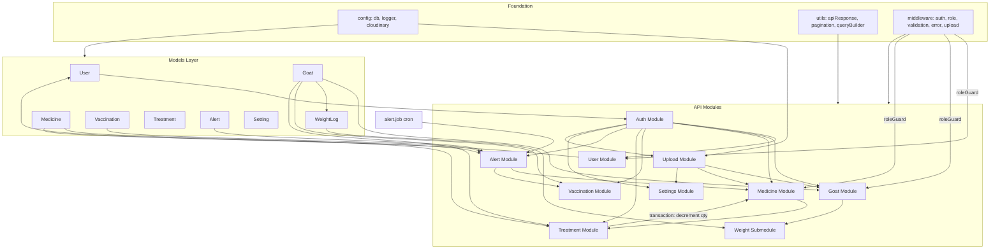

# Goat Farm Management System — Development Plan

## Project Understanding

GFMS is a **single-farm livestock management platform** that replaces paper registers and spreadsheets with a centralized digital system for goat records, health history, medicine inventory, automated alerts, and farm settings.

### Problem & Goals
Small/medium goat farms lose data, miss vaccinations, and cannot track medicine expiry. Success is measured by: 100% digital goat records, automatic vaccination/medicine alerts, search under 500ms, and inventory accuracy above 95%.

### Users & RBAC
Three roles with enforced permissions:

| Role | Scope |
|------|-------|
| **ADMIN** | Full access — goats, medicines, users, settings, all health records |
| **STAFF** | View goats/medicines/alerts; edit goats; record weights & treatments; no deletes or admin |
| **VETERINARIAN** | View goats/medicines/health history; create/edit vaccinations & treatments; no goat delete or user/settings access |

### Core Domain Entities (8 MongoDB collections)
```mermaid
erDiagram
    User ||--o{ Goat : creates
    User ||--o{ Medicine : creates
    User ||--o{ Vaccination : creates
    User ||--o{ Treatment : creates
    Goat ||--o{ WeightLog : has
    Goat ||--o{ Vaccination : receives
    Goat ||--o{ Treatment : receives
    Goat ||--o| Goat : mother
    Goat ||--o| Goat : father
    Medicine ||--o{ Treatment : used_in
    Alert }o--|| Medicine : triggered_by
    Alert }o--|| Vaccination : triggered_by
    Setting : singleton_farm_config
```

### Key Business Rules
- **Goats**: `uidTag` unique; soft-delete only (`isDeleted: true`); parent validation (female mother, male father, no self-reference); `currentWeight` synced from weight logs; profile loads mother, father, kids, weight history, vaccinations, treatments in one request.
- **Medicines**: Status auto-calculated — Expired > Out Of Stock (qty=0) > Low Stock (qty&lt;5) > Available; expiry must be future on create.
- **Treatments**: MongoDB transaction — create treatment, decrement medicine qty by 1, recalculate medicine status; reject if medicine qty=0.
- **Vaccinations**: `nextDueDate` must be after `dateGiven`; due/overdue filters for list API.
- **Alerts**: Daily cron at midnight; 5 types with severity mapping; duplicate prevention via `{ type, referenceId, isRead: false }` (see gaps below).
- **Weight**: Max 300kg; updates `Goat.currentWeight`; history sorted ascending by date.

### Architecture (per TDD)
Layered MVC: **Routes → Controllers → Services → Mongoose Models**, with shared middleware (auth, role, validation, error, upload), utilities (pagination, queryBuilder, apiResponse, cloudinaryUpload), and a daily cron job for alerts.

### Stack (confirmed: PRD/TDD)
- **Backend**: Node.js, Express.js, JavaScript, Mongoose, JWT (7-day), bcryptjs (12 rounds), express-validator, Multer + Cloudinary, Winston, node-cron, Helmet, CORS, express-rate-limit
- **API base**: `/api` (not versioned for MVP)
- **Docs**: Swagger at `/api/docs`; Postman collection
- **Tests**: Jest + Supertest, 80% coverage target
- **Deploy**: Render/Railway/AWS + MongoDB Atlas + Cloudinary; health at `GET /health`
- **Frontend**: Deferred — separate phase after backend MVP is stable

### Contradictions & Missing Requirements (resolve during build)

| Issue | Sources | Resolution |
|-------|---------|------------|
| Goat weight field | PRD: `weight`; TDD: `currentWeight` | Use **`currentWeight`** on Goat model; WeightLog holds history |
| Audit log vs audit fields | PRD: "Audit log created"; TDD: `createdBy`/`updatedBy` only | Use **audit fields** on all records; skip separate audit_log collection unless client requests it |
| Alert `referenceId` | Part 3 duplicate logic references it; Part 1 schema omits it | **Add `referenceId`** (ObjectId) and optional `entityType` to Alert schema |
| User management APIs | PRD/TDD goal lists user mgmt; only register/login/me defined | **Add Admin-only** `GET/POST/PATCH/DELETE /api/users` in Phase 13 |
| Public register with `role` | TDD register accepts role in body | **Restrict**: first user = ADMIN seed; subsequent users created by Admin only |
| Medicine soft delete | TDD recommends it; schema lacks `isDeleted` | **Add `isDeleted`** to Medicine or use hard delete with no-dependent check |
| Treatment DELETE inventory | No spec for qty restoration | **Document decision**: restore qty on delete; use transaction |
| Vaccination/Treatment delete RBAC | Not in permission matrix | **Admin only** for deletes; Staff/Vet cannot delete |
| Staff "Edit Goats" vs Vet | TDD: Vet cannot edit goats or add weight | Align with TDD matrix (Staff edits goats + weight; Vet health records only) |
| Admin create vaccination | PRD matrix: Yes; TDD matrix: not explicit for Admin | **Allow Admin + Vet** for vaccination CRUD |
| Settings singleton | No `_id` strategy documented | Use **fixed singleton** (findOneAndUpdate upsert) or single seeded document |
| CORS dev port | TDD: `:3000`; Vite default `:5173` | Use **`CLIENT_URL` env** — set to actual frontend origin when built |
| Instructions.md conflicts | TypeScript, Zod, refresh tokens, Google OAuth, Socket.io | **Out of MVP scope** per stack choice; revisit in frontend/security hardening phase |

### Suggested Improvements (non-blocking, high value)
1. Add **`referenceId` + `entityType`** on alerts for deduplication and deep-linking.
2. Add **Admin user CRUD** with `isActive` toggle (disabled-user rejection already in edge cases).
3. Add **`PATCH /api/alerts/read-all`** for bulk mark-read.
4. Add **`GET /ready`** with MongoDB connectivity check (production hosts).
5. Add **seed script** for default settings + first admin user.
6. Use **MongoDB text index** on goat `name` + `uidTag` for search performance.
7. On treatment delete/update, **reverse/adjust inventory** in a transaction.
8. Add **`express-mongo-sanitize`** (from Instructions) even though not in TDD — low-cost security win.

---

## Development Phases

### Phase 1 — Project Bootstrap
- Init `backend/` with Express, Mongoose, dotenv, nodemon
- Files: [`backend/src/server.js`](backend/src/server.js), [`backend/src/app.js`](backend/src/app.js), [`backend/src/config/db.js`](backend/src/config/db.js), [`backend/src/config/logger.js`](backend/src/config/logger.js), [`backend/src/config/cloudinary.js`](backend/src/config/cloudinary.js)
- Middleware stack: Helmet, CORS, rate limits (5/min auth, 100/15min API), JSON parser, mongo-sanitize
- Health: `GET /health`, `GET /ready`
- `.env.example`, `.gitignore`, `README.md`

### Phase 2 — Mongoose Models
All 8 models with indexes and audit fields:
- [`User.js`](backend/src/models/User.js), [`Goat.js`](backend/src/models/Goat.js), [`WeightLog.js`](backend/src/models/WeightLog.js), [`Medicine.js`](backend/src/models/Medicine.js), [`Vaccination.js`](backend/src/models/Vaccination.js), [`Treatment.js`](backend/src/models/Treatment.js), [`Alert.js`](backend/src/models/Alert.js) (+ `referenceId`), [`Setting.js`](backend/src/models/Setting.js)

### Phase 3 — Shared Infrastructure
- [`middleware/auth.middleware.js`](backend/src/middleware/auth.middleware.js) — JWT verify, attach `req.user`
- [`middleware/role.middleware.js`](backend/src/middleware/role.middleware.js) — `authorize(...roles)`
- [`middleware/validation.middleware.js`](backend/src/middleware/validation.middleware.js) — express-validator result handler
- [`middleware/error.middleware.js`](backend/src/middleware/error.middleware.js) — centralized errors, no stack in prod
- [`middleware/upload.middleware.js`](backend/src/middleware/upload.middleware.js) — Multer memory, 5MB, image MIME filter
- [`utils/apiResponse.js`](backend/src/utils/apiResponse.js), [`utils/pagination.js`](backend/src/utils/pagination.js), [`utils/queryBuilder.js`](backend/src/utils/queryBuilder.js), [`utils/cloudinaryUpload.js`](backend/src/utils/cloudinaryUpload.js)

### Phase 4 — Authentication Module
- [`validators/auth.validator.js`](backend/src/validators/auth.validator.js)
- [`services/auth.service.js`](backend/src/services/auth.service.js) — register, login, hash (bcrypt 12), JWT sign, lastLogin update, disabled-user check
- [`controllers/auth.controller.js`](backend/src/controllers/auth.controller.js)
- [`routes/auth.routes.js`](backend/src/routes/auth.routes.js)
- Endpoints: `POST /api/auth/register`, `POST /api/auth/login`, `GET /api/auth/me`

### Phase 5 — Goat + Weight Module
- [`validators/goat.validator.js`](backend/src/validators/goat.validator.js)
- [`services/goat.service.js`](backend/src/services/goat.service.js) — CRUD, soft delete, search/filter/sort/pagination, parent validation, family tree
- [`services/weight.service.js`](backend/src/services/weight.service.js) — record weight, update currentWeight, history
- [`controllers/goat.controller.js`](backend/src/controllers/goat.controller.js)
- [`routes/goat.routes.js`](backend/src/routes/goat.routes.js)
- Endpoints: full goat CRUD + `POST /api/goats/:id/weight` + `GET /api/goats/:id/weight-history`

### Phase 6 — Medicine Module
- [`validators/medicine.validator.js`](backend/src/validators/medicine.validator.js)
- [`services/medicine.service.js`](backend/src/services/medicine.service.js) — CRUD, status engine, soft delete
- [`controllers/medicine.controller.js`](backend/src/controllers/medicine.controller.js)
- [`routes/medicine.routes.js`](backend/src/routes/medicine.routes.js)

### Phase 7 — Vaccination Module
- [`validators/vaccination.validator.js`](backend/src/validators/vaccination.validator.js)
- [`services/vaccination.service.js`](backend/src/services/vaccination.service.js) — CRUD, due/overdue/completed filters
- [`controllers/vaccination.controller.js`](backend/src/controllers/vaccination.controller.js)
- [`routes/vaccination.routes.js`](backend/src/routes/vaccination.routes.js)

### Phase 8 — Treatment Module
- [`validators/treatment.validator.js`](backend/src/validators/treatment.validator.js)
- [`services/treatment.service.js`](backend/src/services/treatment.service.js) — CRUD with **MongoDB transactions** for inventory
- [`controllers/treatment.controller.js`](backend/src/controllers/treatment.controller.js)
- [`routes/treatment.routes.js`](backend/src/routes/treatment.routes.js)

### Phase 9 — Alert Engine + Cron
- [`services/alert.service.js`](backend/src/services/alert.service.js) — 5 rules, severity, dedup
- [`controllers/alert.controller.js`](backend/src/controllers/alert.controller.js)
- [`routes/alert.routes.js`](backend/src/routes/alert.routes.js)
- [`jobs/alert.job.js`](backend/src/jobs/alert.job.js) — `0 0 * * *` daily
- Endpoints: `GET /api/alerts`, `PATCH /api/alerts/:id/read`

### Phase 10 — Settings + Upload
- [`controllers/setting.controller.js`](backend/src/controllers/setting.controller.js), [`routes/setting.routes.js`](backend/src/routes/setting.routes.js)
- [`controllers/upload.controller.js`](backend/src/controllers/upload.controller.js), [`routes/upload.routes.js`](backend/src/routes/upload.routes.js)
- Endpoints: `GET/PUT /api/settings`, `POST /api/upload/image`

### Phase 11 — User Management (gap fill)
- [`validators/user.validator.js`](backend/src/validators/user.validator.js)
- [`services/user.service.js`](backend/src/services/user.service.js)
- [`controllers/user.controller.js`](backend/src/controllers/user.controller.js)
- [`routes/user.routes.js`](backend/src/routes/user.routes.js)
- Admin-only: list, create, update role/status, deactivate

### Phase 12 — Documentation & Seed
- Swagger/OpenAPI at `/api/docs` (swagger-jsdoc + swagger-ui-express)
- Postman collection under `backend/postman/`
- Seed script: default settings + first admin

### Phase 13 — Testing & Hardening
- Jest unit tests for services, validators, utils
- Supertest integration tests per route module
- Target 80% coverage; production checklist from TDD Part 4

### Phase 14 — Deployment
- MongoDB Atlas + Cloudinary + Render/Railway
- Env vars, IP allowlist, daily Atlas backup
- Smoke test all MVP acceptance criteria from [PRD.md](PRD.md) Section 15

### Phase 15 — Frontend (post-backend, future)
- React + Vite SPA per [Instructions.md](Instructions.md) when API is stable
- Feature modules mirroring backend: auth, goats, medicines, vaccinations, treatments, alerts, settings, dashboard

---

## Folder Structure

Per [TDD.md](TDD.md) Part 1 Section 4, adapted with gap-fill modules:

```
Goat Farm/
├── backend/
│   ├── src/
│   │   ├── server.js                 # DB connect → cron start → listen
│   │   ├── app.js                    # Middleware + route mounts
│   │   ├── config/
│   │   │   ├── db.js
│   │   │   ├── cloudinary.js
│   │   │   └── logger.js
│   │   ├── models/
│   │   │   ├── User.js
│   │   │   ├── Goat.js
│   │   │   ├── WeightLog.js
│   │   │   ├── Medicine.js
│   │   │   ├── Vaccination.js
│   │   │   ├── Treatment.js
│   │   │   ├── Alert.js
│   │   │   └── Setting.js
│   │   ├── controllers/
│   │   │   ├── auth.controller.js
│   │   │   ├── user.controller.js        # Phase 11
│   │   │   ├── goat.controller.js
│   │   │   ├── medicine.controller.js
│   │   │   ├── vaccination.controller.js
│   │   │   ├── treatment.controller.js
│   │   │   ├── alert.controller.js
│   │   │   ├── setting.controller.js
│   │   │   └── upload.controller.js
│   │   ├── services/
│   │   │   ├── auth.service.js
│   │   │   ├── user.service.js           # Phase 11
│   │   │   ├── goat.service.js
│   │   │   ├── weight.service.js
│   │   │   ├── medicine.service.js
│   │   │   ├── vaccination.service.js
│   │   │   ├── treatment.service.js
│   │   │   └── alert.service.js
│   │   ├── routes/
│   │   │   ├── index.js                  # Aggregates all route modules
│   │   │   ├── auth.routes.js
│   │   │   ├── user.routes.js
│   │   │   ├── goat.routes.js
│   │   │   ├── medicine.routes.js
│   │   │   ├── vaccination.routes.js
│   │   │   ├── treatment.routes.js
│   │   │   ├── alert.routes.js
│   │   │   ├── setting.routes.js
│   │   │   └── upload.routes.js
│   │   ├── middleware/
│   │   │   ├── auth.middleware.js
│   │   │   ├── role.middleware.js
│   │   │   ├── validation.middleware.js
│   │   │   ├── error.middleware.js
│   │   │   └── upload.middleware.js
│   │   ├── validators/
│   │   │   ├── auth.validator.js
│   │   │   ├── user.validator.js
│   │   │   ├── goat.validator.js
│   │   │   ├── medicine.validator.js
│   │   │   ├── vaccination.validator.js
│   │   │   └── treatment.validator.js
│   │   ├── jobs/
│   │   │   └── alert.job.js
│   │   ├── utils/
│   │   │   ├── apiResponse.js
│   │   │   ├── pagination.js
│   │   │   ├── queryBuilder.js
│   │   │   └── cloudinaryUpload.js
│   │   └── scripts/
│   │       └── seed.js                   # Admin + default settings
│   ├── postman/
│   │   ├── collection.json
│   │   └── environment.json
│   ├── logs/                             # Winston output (gitignored)
│   ├── tests/
│   │   ├── unit/
│   │   │   ├── services/
│   │   │   └── utils/
│   │   └── integration/
│   │       ├── auth.test.js
│   │       ├── goats.test.js
│   │       ├── medicines.test.js
│   │       ├── vaccinations.test.js
│   │       ├── treatments.test.js
│   │       └── alerts.test.js
│   ├── .env.example
│   ├── .gitignore
│   ├── package.json
│   └── README.md
├── frontend/                             # Phase 15 — empty until backend stable
├── docs/                                 # Optional: API docs export
├── PRD.md
├── TDD.md
└── Instructions.md
```

### File-by-File Build Order (backend)

| Order | File | Depends On |
|-------|------|------------|
| 1 | `package.json`, `.env.example`, `.gitignore` | — |
| 2 | `config/db.js`, `config/logger.js` | package.json |
| 3 | `utils/apiResponse.js`, `utils/pagination.js` | — |
| 4 | `middleware/error.middleware.js` | apiResponse |
| 5 | `app.js`, `server.js` | config, middleware |
| 6 | All 8 `models/*.js` | db |
| 7 | `middleware/auth.middleware.js`, `middleware/role.middleware.js` | User model |
| 8 | `validators/auth.validator.js`, `services/auth.service.js`, `controllers/auth.controller.js`, `routes/auth.routes.js` | User model, middleware |
| 9 | `utils/queryBuilder.js` | — |
| 10 | Goat stack (validator → service → controller → routes) | Goat, User models, middleware |
| 11 | `services/weight.service.js` + weight routes on goat | Goat, WeightLog |
| 12 | Medicine stack | Medicine model |
| 13 | Vaccination stack | Vaccination, Goat |
| 14 | Treatment stack | Treatment, Goat, Medicine, transactions |
| 15 | `services/alert.service.js`, `jobs/alert.job.js`, alert routes | Medicine, Vaccination, Alert |
| 16 | Setting + upload stacks | Setting, cloudinary config |
| 17 | User management stack | User, auth middleware |
| 18 | Swagger config + `routes/index.js` aggregation | all routes |
| 19 | `scripts/seed.js` | all models |
| 20 | `tests/**` | all modules |

---

## Module Dependencies



### Dependency Rules
1. **Auth is the gate** — every module except `POST /api/auth/login` and initial register/seed requires JWT + RBAC.
2. **Goat is the hub** — vaccinations, treatments, and weight logs all require a valid, non-deleted goat.
3. **Medicine ↔ Treatment is transactional** — treatment creation cannot exist without medicine service; medicine status engine runs after any qty change.
4. **Alert engine is downstream** — reads Medicine + Vaccination collections; must not run until both modules exist; cron wired in `server.js` after DB connect.
5. **Upload is cross-cutting** — optional dependency for goat photo, medicine image, settings logo; does not block core CRUD.
6. **User module is Admin-only** — depends on auth middleware + role guard; independent of domain modules.
7. **Query builder is shared** — used by Goat and Medicine list endpoints at minimum.

### Modules to Build (complete list)

| # | Module | Priority | Key Endpoints |
|---|--------|----------|---------------|
| 1 | Core / Config | P0 | `/health`, `/ready` |
| 2 | Auth | P0 | register, login, me |
| 3 | Goat | P0 | CRUD + search/filter |
| 4 | Weight Log | P0 | record + history |
| 5 | Medicine | P0 | CRUD + status engine |
| 6 | Vaccination | P0 | CRUD + due filters |
| 7 | Treatment | P0 | CRUD + inventory txn |
| 8 | Alert + Cron | P0 | list, mark read, daily job |
| 9 | Settings | P1 | get, update |
| 10 | Upload | P1 | image upload |
| 11 | User Management | P1 | Admin CRUD |
| 12 | Swagger / Postman | P1 | `/api/docs` |
| 13 | Tests | P1 | Jest + Supertest |
| 14 | Seed / Deploy | P1 | seed script, prod config |
| 15 | Frontend | P2 (deferred) | React SPA |
